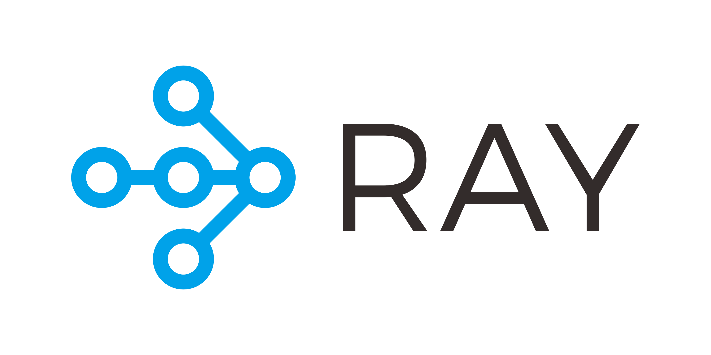

# Introduction to Ray for Distributed Applications 

© 2019-2022, Anyscale. All Rights Reserved

An introduction to [Ray](https://www.ray.io/), the system for scaling your Python and machine learning workloads from a laptop to a cluster. 
We'll start with a hands-on exploration of the core Ray APIs for distributed workloads, covering basic distributed Ray Core API patterns, and 
then move on to a quick introduction to one of Ray's native libraries:

 * Remote functions as tasks
 * Remote objects as futures
 * Remote classes as stateful actors

### Outline for this Tutorial Lesson 📖

Divided into three modules, each module will take about an hour, combined with lecture and followed by hands-on 👩‍💻 exercises in class.

### Module 1 
 * Lecture 20 mins
   * What is Ray and Why & Origins
   * Ray Component & Architecture
   * Ray Core API Decorators & Patterns
 * Notebooks & Exercises 
    * Ray Functions as distribtued stateless tasks
    * Ray Objects as Distributed future objects 
    * Ray Actors as distributed stateful services
   
### In this tutorial, you will:
  * 👩‍💻Understand what the Ray ecosystem is and why to use it
  * 📖Learn Ray's Core basic APIs and Python APIs
  * 🧑‍💻Use Ray APIs to convert Python functions and classes into distributed stateless and stateful tasks
  * 🎛 Use Dashboard for inspection and observation
  * 🧑‍💻Discover the purpose of Ray native libraries and how to use them

### 🎓Prerequisite knowledge ###
**Level**: Beginners or new to Ray

 * Familiarity with Python 3.9+ and basic programming concepts: lists, comprehensions, decorators, functions, dictionaries, classes, loops, exceptional handling, etc
 * A UNIX based Laptop with at least 8-16GB Memory with latest Chrome browser
 * Prior knowledge of Jupyter notebooks 
 * Basic knowledge of machine learning concepts
 
 
## 👩 Setup instructions for local Unix based-laptop 💻
If you want to follow the material in class, please follow this instructions before class to setup your laptop.

### Using conda
If you need to install Anaconda, follow the instructions [here](https://www.anaconda.com/products/distribution).
If you already have Anaconda installed, consider running conda `upgrade --all.`

1. `conda create -n ray-core-tutorial-devai23 python=3.10`
2. `conda activate ray-core-tutorial-devai23`
3. `git clone git@github.com:dmatrix/devAIWorld23.git`
4. `cd to <cloned_dir>`
5. `python3 -m pip install -r requirements.txt`
7. `jupyter lab`

### Installing on Apple M1 for MacBook Pro
If you are using [Apple M1](https://docs.ray.io/en/latest/ray-overview/installation.html#m1-mac-apple-silicon-support) laptop 🍎 follow the following instructions:

1. `conda create -n ray-core-tutorial-devai23 python=3.10`
2. `conda activate ray-core-tutorial-devai23`
3. `conda install grpcio=1.43.0 -c conda-forge`
3. `git clone git@github.com:dmatrix/devAIWorld23.git`
5. `cd to <cloned_dir>`
6. `python3 -m pip install -r requirements.txt`
9. `jupyter lab`

### Using only pip
1. `git clone git@github.com:dmatrix/devAIWorld23.git`
2. `cd to <cloned_dir>`
3. `python3 -m pip install -r requirements.txt`
5. `jupyter lab`
 
Let's have 😜 fun with Ray! 
